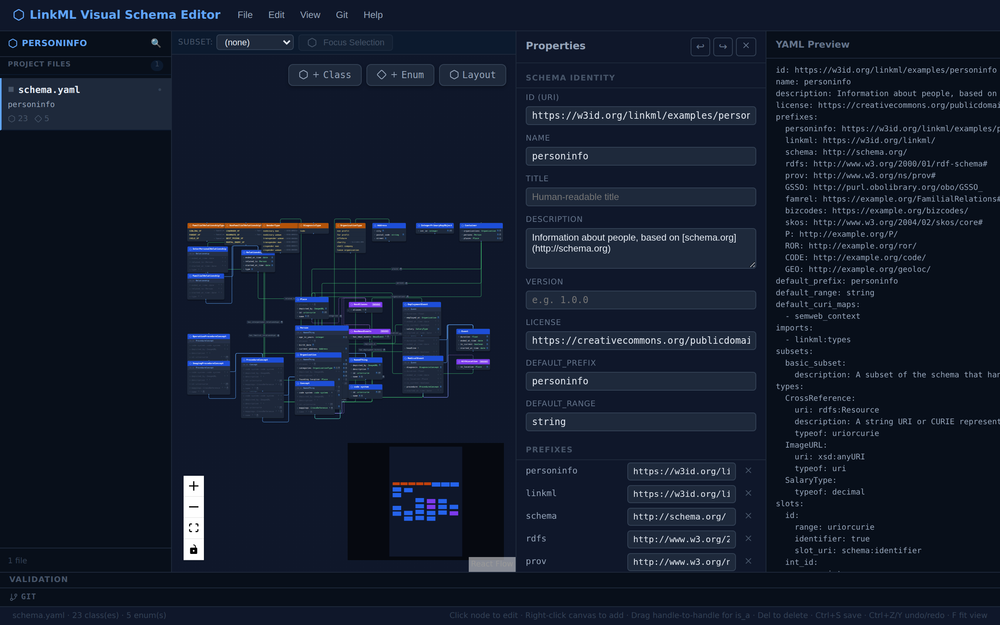
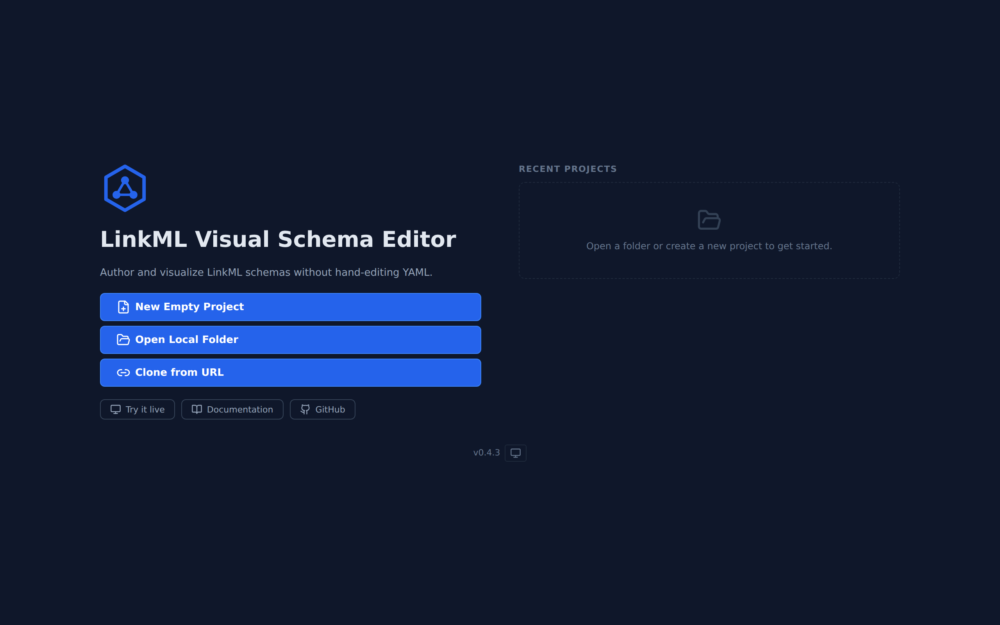
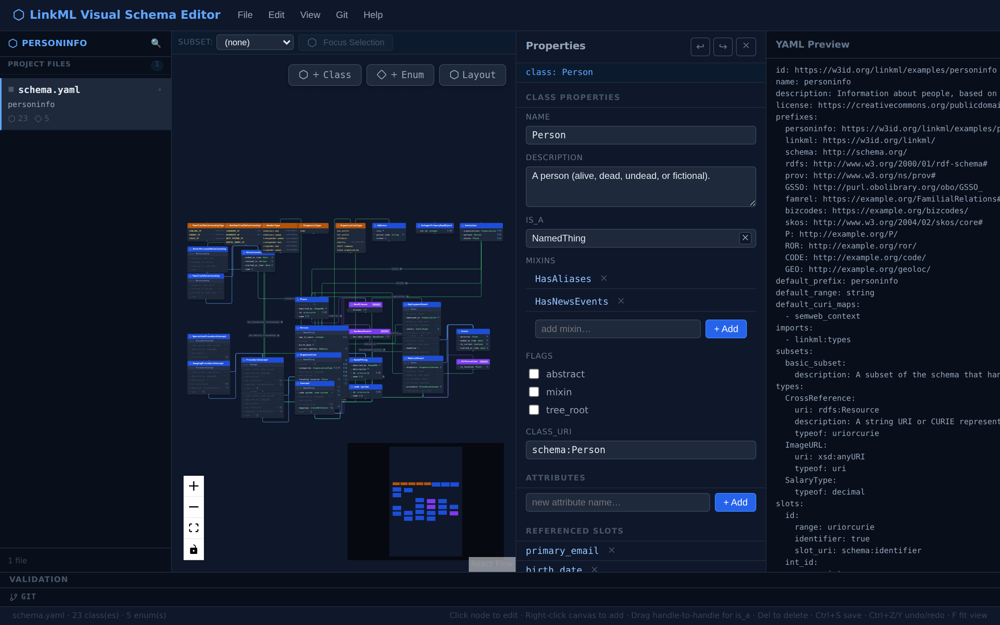
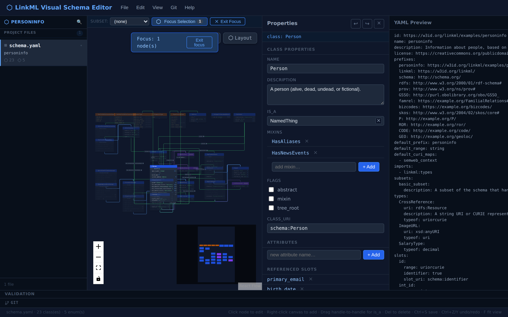
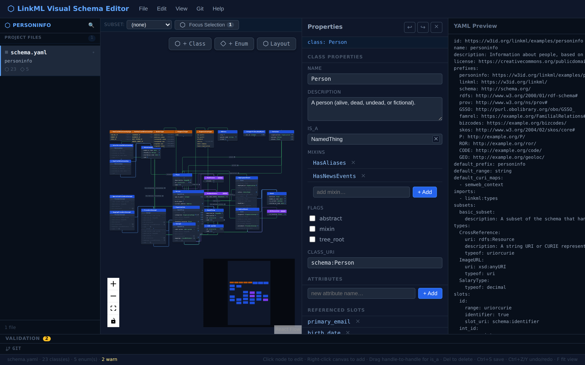

<p align="center">
  
</p>

<h1 align="center">LinkML Visual Schema Editor</h1>

<p align="center">
  A cross-platform graphical tool for authoring, editing, and visualizing <a href="https://linkml.io/">LinkML</a> schemas on an ERD-style canvas — without hand-editing YAML.
</p>

<p align="center">
  <a href="https://adamlabadorf.github.io/linkml-modeler-app/app/"></a>
  <a href="https://adamlabadorf.github.io/linkml-modeler-app/"></a>
  <a href="LICENSE"></a>
</p>

<p align="center">
  
</p>

---

## Features

- **Visual ERD canvas** — drag, connect, and arrange LinkML classes and enums without touching YAML
- **Properties panel** — edit slot definitions, ranges, and constraints in a structured side panel
- **Real-time YAML** — live YAML preview with best-effort semantic round-trip preservation; recognized LinkML fields and unknown extras are preserved; formatting details (comments, blank lines, quoting style, YAML anchors, key ordering) are not
- **Schema validation** — structural checks including naming conventions (PascalCase classes/enums, snake_case slots), existence checks for is_a/mixin/range references, and inheritance cycle detection
- **Focus mode** — zero in on selected nodes and their direct relationships
- **Git integration** — clone, commit, push, and pull directly from the editor (browser OPFS or Electron fs)
- **Multi-schema support** — work with schemas that import other schemas; imported entities shown as read-only ghost nodes
- **Dark & light themes** — system-aware with manual toggle

## Feature Status

| Feature | Status | Notes |
|---------|--------|-------|
| Web app | Supported | Primary v1.0 target |
| Visual ERD canvas | Supported | Core workflow |
| YAML preview/export | Supported | Unknown fields preserved; large schemas may have round-trip limits |
| Structural validation | Supported | Meta-model checks: naming conventions, is_a/mixin/range existence, inheritance cycles, and schema metadata. No instance-data validation. |
| Git local operations | Beta | Works via browser OPFS; behaviour may vary across browsers |
| Git remote operations | Beta | Requires a configured CORS proxy (`VITE_GIT_CORS_PROXY`); credentials are session-only |
| Multi-schema imports | Beta | Imported entities shown as read-only ghost nodes |
| Electron desktop | Experimental | Preserved for community interest; not part of the v1.0 supported surface |

**Legend:** _Supported_ — stable and tested for v1.0. _Beta_ — functional but with known limitations or environment requirements. _Experimental_ — available but unsupported; may change or be removed.

---

## Screenshots

<table>
  <tr>
    <td></td>
    <td></td>
  </tr>
  <tr>
    <td align="center"><em>Splash — new / recent project picker</em></td>
    <td align="center"><em>Properties panel — class & slot editor</em></td>
  </tr>
  <tr>
    <td></td>
    <td></td>
  </tr>
  <tr>
    <td align="center"><em>Focus mode — isolate selected entities</em></td>
    <td align="center"><em>Validation panel — errors & warnings</em></td>
  </tr>
</table>

---

## Quick Start

### Prerequisites

- [Node.js](https://nodejs.org/) >= 20.0.0
- [pnpm](https://pnpm.io/) >= 9.0.0 (`npm install -g pnpm`)

### Install dependencies

```bash
pnpm install
```

### Run the web app (development)

```bash
pnpm dev
```

Opens at [http://localhost:5173](http://localhost:5173). Hot module replacement is enabled.

### Build for production

```bash
pnpm build
```

- **Web output:** `packages/web/dist/` — serve these static files from any web server.

---

## Documentation

**[View the full documentation site →](https://adamlabadorf.github.io/linkml-modeler-app/)**

| Document | Description |
|---|---|
| [User Guide](https://adamlabadorf.github.io/linkml-modeler-app/user-guide) | How to use the editor |
| [Developer Guide](https://adamlabadorf.github.io/linkml-modeler-app/development) | Developer setup, architecture, and contribution guide |
| [Design Spec](https://adamlabadorf.github.io/linkml-modeler-app/design-spec) | Full design specification |

---

## Repository Structure

```
packages/
├── core/       # Shared React app (renderer) — canvas, editor, store, IO, model, UI
├── web/        # Vite web build harness + platform adapter
├── electron/   # Electron main process + IPC handlers
└── docs/       # VitePress documentation site
docs/
├── screenshots/      # App screenshots (source)
├── design-spec.md
├── user-guide.md
└── development.md
```

## Tech Stack

React 18 + TypeScript · ReactFlow · Zustand · js-yaml · Lucide · Vite · isomorphic-git

Styling uses CSS custom properties for theming; no CSS framework is bundled.

## Scripts

| Command | Description |
|---|---|
| `pnpm dev` | Start web dev server (localhost:5173) |
| `pnpm build` | Build core + web for production (use `build:all` for desktop) |
| `pnpm test` | Run all tests |
| `pnpm lint` | Lint TypeScript/TSX source files |
| `pnpm format` | Format source files with Prettier |

---

## Experimental: desktop build

`packages/electron/` contains an Electron main-process wrapper. It is preserved for community interest but is **not part of the v1.0 supported surface**. The web app is the primary deployment target for v1.0.

To run the desktop build in development (unsupported):

```bash
# Terminal 1
pnpm dev

# Terminal 2
pnpm --filter @linkml-editor/electron build && npx electron packages/electron/dist/main.js
```

A native desktop release is planned for a future version.

---

## Contributing

See [CONTRIBUTING.md](CONTRIBUTING.md) for setup instructions, development workflow, and PR conventions.

---

## License

[MIT](LICENSE)
